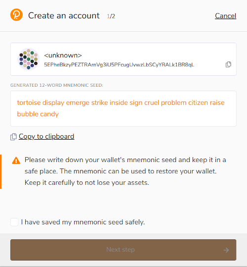
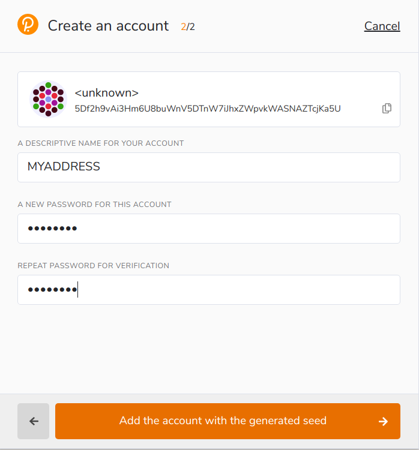
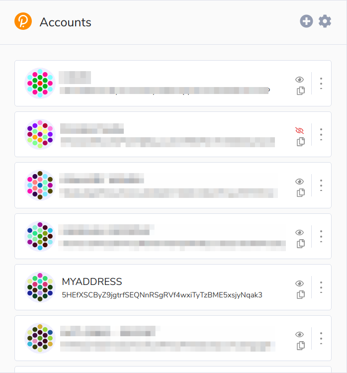

Getting Started
===============

Creating Accounts
-----------------

`Unique Network <https://uniquenetwork.io>`_, like most blockchains, is based on accounts or addresses. An address can own NFTs or some Unique token. It can sign transactions to transfer these valuable assets to other addresses or to make some actions in Decentralized Apps (dApps). For example, an address can buy and sell NFTs on the NFT Market.

The typical Unique address looks like this::

    5HEfXSCByZ9jgtrfSEQNnRSgRVf4wxiTyTzBME5xsjyNqak3

One way to create an address for yourself is to use `Polkadot{.js} browser extension for Chrome browser <https://chrome.google.com/webstore/detail/polkadot%7Bjs%7D-extension/mopnmbcafieddcagagdcbnhejhlodfdd>`_ or `Polkadot{.js} browser extension for Firefox <https://addons.mozilla.org/en-US/firefox/addon/polkadot-js-extension/>`_.

Once it is installed, open the Polkadot{.js} extension and create the address. The extension will display the mnemonic seed. Make sure you save it securely because this is the only way to restore your address. This mnemonic seed can also be used to sign transactions in JavaScript code. In the examples we use the mnemonic seed for Alice account (seed: "//Alice"), but you can replace it with your seed to work with TestNet or MainNet.

In the next step enter the name and password for the account. The password will be needed every time when you sign a transaction:

The new address will appear in the list:

Finally, you can open the `UniqueApps UI <https://polkadot.js.org/apps/?rpc=wss%3A%2F%2Ftestnet2.uniquenetwork.io#/accounts>`_ to see your address.

Unique TestNet Faucet
---------------------

In order to get transactions working on the TestNet, you will need some TestNet tokens. 

You can get them from our Telegram bot: `@UniqueFaucetBot <https://t.me/unique2faucetbot>`_

Once the transaction is processed, you may open the `UniqueApps UI <https://uniqueapps.usetech.com/#/accounts>`_ to see how your address' balance increased (make sure the UI is connected to the TestNet in settings page).

